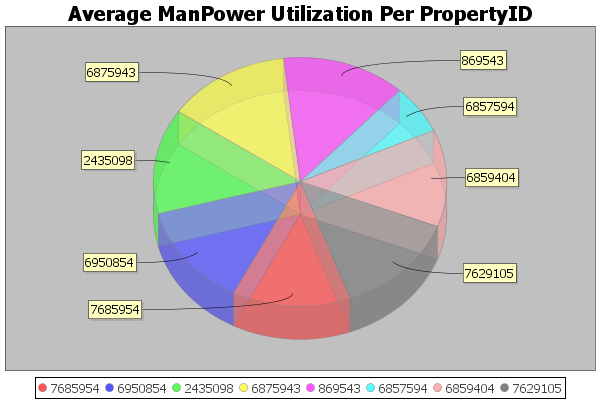

# java-meets-elasticsearch

<!DOCTYPE html>
<html>
<head>
</head>
<body>
<h3>This project aims to integrate elastic search with java </h3>
 
 
<h4>Aim : Pushing user data to elastic search and runnig some analysis on the data.  </h4>

<h3>Contributions</h3>

<h4>There can be a front end which can be created. A form , which takes the data from the user.</h5>
	
</body>
</html>
